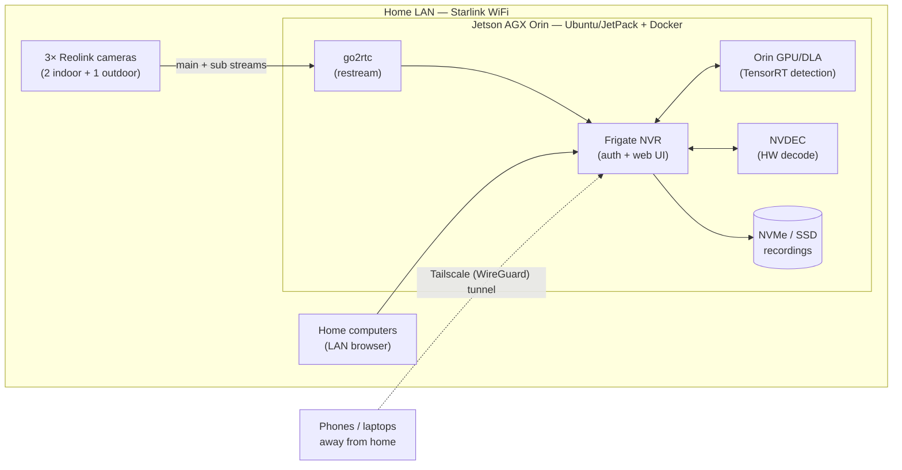

# homesec

A privacy-respecting home video-surveillance system: three [Reolink](https://reolink.com)
WiFi cameras feeding a local [Frigate](https://frigate.video) network video recorder (NVR)
running on our own hardware — object detection done locally (on an NVIDIA Jetson's GPU, or a
[Google Coral](https://coral.ai) Edge TPU), and video reachable remotely only over our own
encrypted [Tailscale](https://tailscale.com) network.  Nothing goes to a vendor cloud.

> **Status: early bring-up.**  Milestone 1 (planning) is largely done — the roadmap, the
> hardware/network inventories, and the architecture decisions (ADRs) live in [`docs/`](docs/).
> We're now standing up the first hardware: the outdoor camera and the server.  The server
> configuration and Frigate config described below are still being built out — see the
> [roadmap](docs/GITHUB_PROJECT.md) for the plan and current state.

---

## Goals

In priority order:

1. **Local-first and private.**  Video stays in the house; it is reachable remotely only over
   our own Tailscale network.  The cameras' vendor cloud (Reolink UID/P2P) is disabled once the
   NVR is running; object detection runs on our own hardware, never a cloud service.
2. **Reliable and unattended.**  The server runs headless 24/7, recovers after power failures,
   and alerts us when a camera drops offline or the disk fills — rather than failing silently
   until the day we need the footage.
3. **Reproducible.**  The server configuration — OS, Frigate, Tailscale, monitoring — is
   captured in this repository (as a Docker/Compose stack; NixOS optional), so rebuilding on new
   hardware is a checkout-and-redeploy, not archaeology.
4. **Efficient.**  The host handles three cameras comfortably without a big power bill — on the
   Jetson, detection on its GPU/DLA and decode on its NVDEC engine; on an x86 host, the Coral
   for detection and an Intel iGPU for decode.

## Hardware

| # | Device | Role |
|---|--------|------|
| 2× | Reolink E1 (4MP, WiFi 6, pan-tilt) | Indoor cameras |
| 1× | Reolink RLC-811WA (4K/8MP, 5× zoom, WiFi 6) | Outdoor camera |
| 1× | NVIDIA Jetson AGX Orin 64 GB (Ubuntu/JetPack) | NVR server — **current frontrunner** |
| 1× | Google Coral USB Accelerator (Edge TPU) | Object detection on an x86 host (optional; unused if the Jetson hosts) |
| 1× | Lenovo X1 Yoga (3rd gen) | Low-power host candidate (currently being revived) |
| 1× | Linux desktop (8 GB GPU) | Fallback host / stretch compute |
| — | Starlink router | WiFi uplink (CGNAT — no inbound connections) |

The host choice (Jetson vs. desktop vs. laptop) is still open; it will be recorded as
**ADR-003** (issue #5) once the power measurements are in.  The Jetson leads on raw
capability, but the final call weighs that against measured power draw — where the low-power
laptop could still win.  See [`docs/HARDWARE.md`](docs/HARDWARE.md) for the full inventory and
current status.

## Architecture

The NVR software is Frigate, restreaming through
[go2rtc](https://github.com/AlexxIT/go2rtc).  On the frontrunner host — the Jetson AGX Orin —
video is decoded on its NVDEC media engine and objects are detected on its GPU/DLA (via
TensorRT); on an x86 host instead, the Coral does detection and an Intel iGPU decodes.
Monitoring is local-first: computers on the LAN reach the Frigate UI directly, and phones reach
it remotely over Tailscale — Starlink's CGNAT makes conventional port forwarding impossible,
and exposing the NVR to the public internet is something we would not want anyway.



(On an x86 host, the **Orin GPU/DLA** box becomes the **Coral USB TPU** and **NVDEC** becomes
**Intel iGPU / VAAPI**.)

## Repository layout

```
docs/GITHUB_PROJECT.md   The project roadmap: milestones, labels, and issues.
docs/HARDWARE.md         Hardware inventory, server-host status, and system requirements.
docs/NETWORK.md          Starlink environment, LAN address plan, WiFi/bandwidth notes.
docs/adr/                Architecture Decision Records (remote access, NVR software, ...).
scripts/python/          Tooling to create/refresh the GitHub project from the roadmap.
scripts/README.md        How the scripts work and how to run them.
```

As milestones land, the server configuration (a Docker Compose stack, and optionally a NixOS
module) and the remaining operational docs (`docs/CAMERAS.md`, `docs/ACCESS.md`,
`docs/RUNBOOK.md`) will join the tree — see the roadmap for what goes where.

## Roadmap

The plan is organized into seven milestones: planning and architecture decisions (M1), camera
bring-up and hardening (M2), the server foundation (M3), Frigate deployment (M4), remote and
mobile access (M5), operations and security (M6), and optional stretch goals (M7).  The full
breakdown — with per-issue tasks, exit criteria, and a dependency graph — lives in
[`docs/GITHUB_PROJECT.md`](docs/GITHUB_PROJECT.md).

## Quick start

The runnable code today is the project-planning tooling, which turns the roadmap into a tracked
GitHub project (milestones, labels, and issues).  With [`gh`](https://cli.github.com/) installed
and authenticated:

```zsh
# Preview what would be created — makes no changes:
python3 scripts/python/gh_project_populate.py docs/GITHUB_PROJECT.md \
    --repo williamdemeo/homesec --dry-run

# Create the milestones, labels, and issues (prompts for confirmation):
python3 scripts/python/gh_project_populate.py docs/GITHUB_PROJECT.md \
    --repo williamdemeo/homesec
```

After bootstrap, GitHub is the source of truth for issue state; regenerate the issue listings in
the roadmap from live GitHub state with `scripts/python/gh_project_render.py`.  See
[`scripts/README.md`](scripts/README.md) for the full workflow, staged creation, and resume
options.

> Deploying the surveillance system itself — standing up the server, wiring up Frigate and the
> cameras, and onboarding phones — is the subject of milestones M2–M5 and will get its own quick
> start once that configuration exists.
