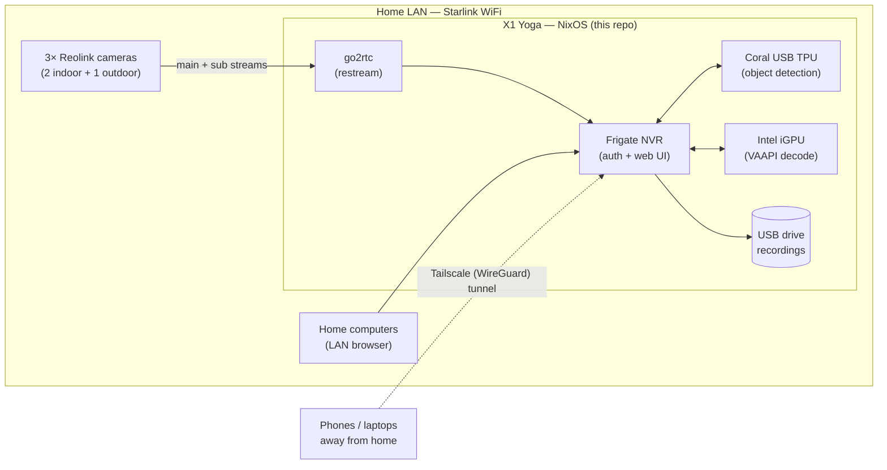

# homesec

A privacy-respecting home video-surveillance system: three [Reolink](https://reolink.com)
WiFi cameras, a [Google Coral](https://coral.ai) Edge TPU for local object detection, and a
repurposed laptop running [NixOS](https://nixos.org) as a 24/7 network video recorder (NVR).
Everything runs on hardware we own — video never leaves the house except over our own
encrypted overlay network, and detection runs locally rather than in anyone's cloud.

> **Status: planning.**  This repository currently holds the project roadmap
> ([`docs/GITHUB_PROJECT.md`](docs/GITHUB_PROJECT.md)) and the tooling that turns it into a
> tracked GitHub project.  The NixOS server configuration, Frigate config, and documentation
> described below are being built out milestone by milestone — see the roadmap for the plan
> and current state.

---

## Goals

In priority order:

1. **Local-first and private.**  Video stays in the house; it is reachable remotely only over
   our own [Tailscale](https://tailscale.com) network.  The cameras' vendor cloud (Reolink
   UID/P2P) is disabled once the NVR is running; object detection runs on the Coral, not a
   cloud service.
2. **Reliable and unattended.**  The server runs headless 24/7, recovers after power failures
   (the laptop battery doubles as a built-in UPS), and alerts us when a camera drops offline or
   the disk fills — rather than failing silently until the day we need the footage.
3. **Declarative and reproducible.**  The entire server — NixOS system, Frigate, Tailscale,
   monitoring — lives in this repository as a Nix flake.  Rebuilding on new hardware is a
   checkout-and-rebuild operation, not archaeology.
4. **Cheap to run.**  A low-power laptop with hardware video decode on its Intel iGPU and
   inference on the Coral handles three cameras comfortably, at a fraction of a desktop's
   idle draw.

## Hardware

| # | Device | Role |
|---|--------|------|
| 2× | Reolink E1 (4MP, WiFi 6, pan-tilt) | Indoor cameras |
| 1× | Reolink RLC-811WA (4K/8MP, 5× zoom, WiFi 6) | Outdoor camera |
| 1× | Google Coral USB Accelerator (Edge TPU) | Local object detection |
| 1× | Lenovo X1 Yoga (3rd gen), NixOS | NVR server (battery = built-in UPS) |
| 1× | Linux desktop (8 GB GPU) | Reserve / stretch compute |
| — | Starlink router | WiFi uplink (CGNAT — no inbound connections) |

## Architecture

The NVR software is [Frigate](https://frigate.video), restreaming through
[go2rtc](https://github.com/AlexxIT/go2rtc), with hardware video decode on the laptop's Intel
Quick Sync iGPU and ML inference on the Coral.  Monitoring is local-first: computers on the LAN
reach the Frigate UI directly, and phones reach it remotely over Tailscale — Starlink's CGNAT
makes conventional port forwarding impossible, and exposing the NVR to the public internet is
something we would not want anyway.



## Repository layout

```
docs/GITHUB_PROJECT.md   The project roadmap: milestones, labels, and issues.
scripts/python/          Tooling to create/refresh the GitHub project from the roadmap.
scripts/README.md        How the scripts work and how to run them.
```

As milestones land, the NixOS flake (`nixos/`, or similar), the Frigate configuration, and the
operational docs (`docs/HARDWARE.md`, `docs/NETWORK.md`, `docs/CAMERAS.md`, `docs/ACCESS.md`,
`docs/RUNBOOK.md`) will join the tree — see the roadmap for what goes where.

## Roadmap

The plan is organized into seven milestones: planning and architecture decisions (M1), camera
bring-up and hardening (M2), the NixOS server foundation (M3), Frigate deployment (M4), remote
and mobile access (M5), operations and security (M6), and optional stretch goals (M7).  The
full breakdown — with per-issue tasks, exit criteria, and a dependency graph — lives in
[`docs/GITHUB_PROJECT.md`](docs/GITHUB_PROJECT.md).

## Quick start

The only runnable code today is the project-planning tooling, which turns the roadmap into a
GitHub project (milestones, labels, and issues).  With [`gh`](https://cli.github.com/)
installed and authenticated:

```zsh
# Preview what would be created — makes no changes:
python3 scripts/python/gh_project_populate.py docs/GITHUB_PROJECT.md \
    --repo williamdemeo/homesec --dry-run

# Create the milestones, labels, and issues (prompts for confirmation):
python3 scripts/python/gh_project_populate.py docs/GITHUB_PROJECT.md \
    --repo williamdemeo/homesec
```

After bootstrap, GitHub is the source of truth for issue state; regenerate the issue listings
in the roadmap from live GitHub state with `scripts/python/gh_project_render.py`.  See
[`scripts/README.md`](scripts/README.md) for the full workflow, staged creation, and resume
options.

> Deploying the surveillance system itself — flashing the server, wiring up Frigate and the
> Coral, and onboarding phones — is the subject of milestones M2–M5 and will get its own quick
> start once that configuration exists.
