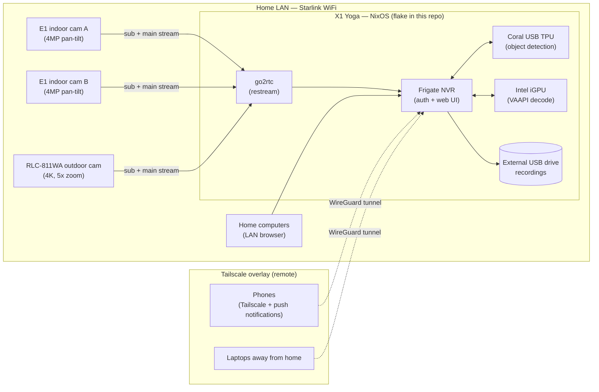
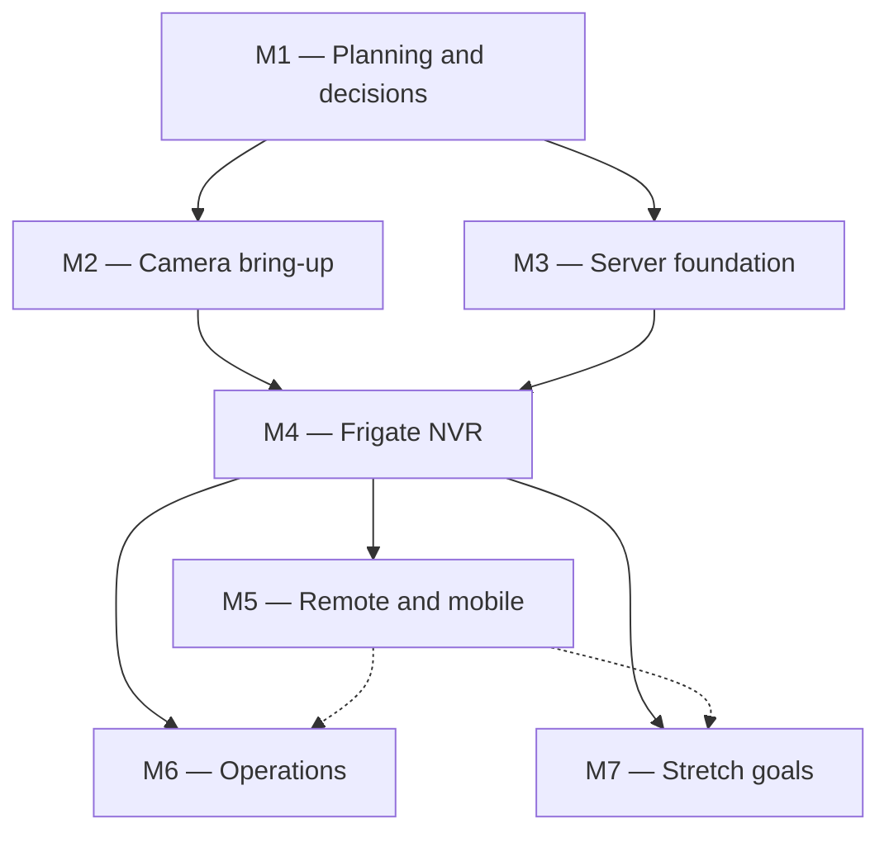
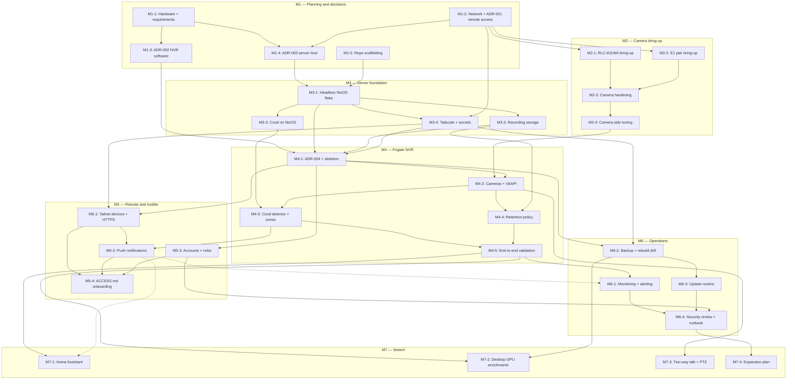

<!--
File: docs/GITHUB_PROJECT.md

This file is partially generated by scripts/python/gh_project_render.py.
Manual prose (milestone descriptions, exit criteria, mermaid graphs)
is hand-edited.  Issue listings between

    BEGIN GENERATED: milestone-N
    ...
    END GENERATED: milestone-N

markers are regenerated from GitHub state by gh_project_render.py;
edits to those regions will be overwritten on the next render.
-->

# homesec — GitHub Project Roadmap

**Project Title**:  homesec 1.0 — Cameras, Coral-accelerated NVR, and remote monitoring on Nix

**Repository**:  `williamdemeo/homesec`

**Date**:  2026-07-14

---

## Summary

A privacy-respecting home video-surveillance system built from three Reolink WiFi cameras (two E1 4MP indoor pan-tilt units and one RLC-811WA 4K outdoor unit with 5× optical zoom), a Google Coral USB Edge TPU for local person/pet/vehicle detection, and a repurposed Lenovo X1 Yoga (3rd gen) running NixOS as the 24/7 NVR server.  The NVR software is Frigate, restreaming through go2rtc, with hardware video decode on the laptop's Intel iGPU and ML inference on the Coral.  Monitoring is local-first: computers on the LAN reach the Frigate UI directly, and phones reach it remotely over a Tailscale overlay network — Starlink's CGNAT makes conventional port forwarding impossible, and we would not want to expose the NVR to the internet anyway.  Work is organized into seven milestones: planning and architecture decisions (M1), camera bring-up and hardening (M2), server foundation on NixOS (M3), Frigate deployment (M4), remote and mobile access (M5), operations (M6), and stretch goals (M7).

---

## Description

The design goals, in priority order:

1. **Local-first and private.**  Video never leaves the house except over our own encrypted overlay network.  The cameras' vendor cloud (Reolink UID/P2P) is disabled once the NVR is running; detection runs locally on the Coral, not on anyone's cloud service.
2. **Reliable and unattended.**  The server runs headless 24/7, restarts itself after power failures (with the laptop battery acting as a built-in UPS), and alerts us when a camera goes offline or the disk fills up — rather than failing silently until the day we actually need footage.
3. **Declarative and reproducible.**  The entire server configuration — NixOS system, Frigate config, Tailscale, monitoring — lives in this repository as a Nix flake.  Rebuilding the server on new hardware should be a checkout-and-rebuild operation, not archaeology.
4. **Cheap to run.**  The X1 Yoga idles at roughly a tenth of the desktop's draw.  With decode on its Intel Quick Sync iGPU and inference on the Coral, three cameras are well within its capacity.  The desktop (with its 8 GB GPU) is held in reserve for compute-hungry stretch features (M7-2) rather than burning watts from day one.

The dependency spine is: decisions first (M1), then camera bring-up (M2) and server foundation (M3) in parallel, converging on the Frigate deployment (M4).  Remote access (M5) and operational hardening (M6) build on a working NVR, and the stretch milestone (M7) is explicitly optional.

---

## Hardware inventory

| # | Device | Role | Key specs |
|---|--------|------|-----------|
| 2× | Reolink E1 (4MP, WiFi 6) | Indoor cameras (pan-tilt) | 4MP, 2.4/5 GHz, pan/tilt, human/pet detection, night vision, 2-way talk, microSD slot |
| 1× | Reolink RLC-811WA | Outdoor camera | 4K/8MP, 5× optical zoom, WiFi 6, H.265, color night vision, human/vehicle/animal detection, microSD slot |
| 1× | Google Coral USB Accelerator | Edge TPU for NVR object detection | USB 3.0; ~10 ms/inference on Frigate's default MobileDet model |
| 1× | Lenovo X1 Yoga (3rd gen) | NVR server (chosen in ADR-003) | 8th-gen Intel Core (UHD 620 iGPU: VAAPI/Quick Sync decode incl. HEVC), NVMe, USB-A 3.0, battery = built-in UPS |
| 1× | Linux desktop | Reserve / stretch compute | Large PSU, fast CPU, 8 GB GPU; higher idle draw — reserved for M7-2 |
| — | Starlink router | WiFi / uplink | CGNAT (no inbound connections); limited router features |

---

## System architecture (target)



---

## Labels

- `milestone-1-planning` (0075ca) — Milestone 1: Planning, network, and architecture decisions.
- `milestone-2-cameras` (0075ca) — Milestone 2: Camera bring-up and hardening.
- `milestone-3-server` (0075ca) — Milestone 3: Server foundation on NixOS.
- `milestone-4-frigate` (0075ca) — Milestone 4: Frigate NVR deployment.
- `milestone-5-remote` (5319e7) — Milestone 5: Remote and mobile access.
- `milestone-6-ops` (5319e7) — Milestone 6: Operations, monitoring, and security review.
- `milestone-7-stretch` (5319e7) — Milestone 7: Stretch goals and future work.
- `hardware` (d93f0b) — Physical equipment: cameras, Coral TPU, server machines, storage.
- `network` (fbca04) — WiFi, Starlink, Tailscale, and remote-access plumbing.
- `nix` (7057ff) — Nix flake and NixOS configuration.
- `frigate` (0e8a16) — Frigate / go2rtc configuration and tuning.
- `security` (b60205) — Security, privacy, and hardening.
- `documentation` (1d76db) — Documentation and runbooks.
- `decision` (c5def5) — Needs an ADR / design decision before implementation.
- `mobile` (bfd4f2) — Phone access and notifications.
- `stretch` (e4e669) — Optional stretch goal / future work.

---

## Milestones

### Milestone 1 — Planning, network, and architecture decisions

**Description**:

Establish the decisions that shape everything downstream, and record them as short ADRs in `docs/adr/`.  Inventory the hardware and write down what the system must do (`docs/HARDWARE.md`).  Assess the Starlink network — CGNAT means no inbound connections, which forces the remote-access architecture toward an overlay VPN (ADR-001) — and survey WiFi signal at the intended camera locations (`docs/NETWORK.md`).  Choose the NVR software (ADR-002; Frigate is the presumptive choice given first-class Coral support) and the server host (ADR-003; the X1 Yoga is the presumptive choice on power cost, with the desktop held in reserve).  Scaffold the repository so subsequent work has a home.

**Exit criterion**: ADR-001 (remote access), ADR-002 (NVR software), and ADR-003 (server host) are merged; `docs/HARDWARE.md` and `docs/NETWORK.md` are merged; the repository has a README describing the system, a `docs/` tree, and a `.gitignore` that keeps secrets out of git.

---

### Milestone 2 — Camera bring-up and hardening

**Description**:

Get all three cameras out of their boxes, onto current firmware, joined to the WiFi at fixed addresses, and locked down.  Verify from a Linux host that each camera serves usable main and sub streams (RTSP where reliable; Reolink's HTTP-FLV stream where Frigate's Reolink guidance recommends it — E1-family RTSP support varies by hardware revision and firmware, so this must be tested, not assumed).  Harden each camera: strong unique passwords, a dedicated least-privilege account for the NVR to use, vendor cloud (UID/P2P) disabled, NTP configured.  Tune camera-side settings for NVR duty: sub-stream resolution/frame-rate suited to detection, main-stream codec and bitrate suited to recording, night-vision behavior, and microSD cards installed as camera-local failover recording.

**Exit criterion**: each camera is reachable at a stable address with current firmware; main and sub streams verified with `ffprobe` from the server; UID/P2P disabled and a dedicated NVR account in place on every camera; per-camera settings and stream URLs documented in `docs/CAMERAS.md`.

---

### Milestone 3 — Server foundation on NixOS

**Description**:

Turn the X1 Yoga into a headless, declaratively-configured NixOS server defined by a flake in this repository.  Configure laptop-as-server behavior: ignore the lid switch, never suspend, power back on after outages, and set battery-charge thresholds so the always-plugged-in battery survives as a built-in UPS.  Attach and mount external USB storage sized for the recording retention policy.  Get the Coral USB accelerator recognized and running a test inference.  Bring up Tailscale and harden SSH, with secrets (camera credentials, Tailscale auth key) handled by an encrypted-secrets tool rather than committed plaintext.

**Exit criterion**: the laptop boots headless with the lid closed and is rebuilt from `nixos-rebuild switch --flake` against this repo; the recordings volume is mounted declaratively; the Coral completes a documented test inference; the server is reachable over Tailscale with password SSH disabled; no plaintext secret is committed.

---

### Milestone 4 — Frigate NVR deployment

**Description**:

Deploy Frigate on the server (deployment mechanism — nixpkgs module vs. pinned OCI container — decided in ADR-004) with go2rtc restreaming, authentication enabled, all three cameras configured (detect on sub streams, record on main streams), VAAPI hardware decode on the iGPU, and object detection on the Coral.  Define the recording and retention policy, then validate the whole system end-to-end: walk tests day and night, pet and vehicle detection, false-positive tuning with zones and motion masks, and a week of storage observation.

**Exit criterion**: the Frigate UI shows live view of all three cameras; detection runs on the Coral (not CPU fallback) at expected inference speed; detection events are recorded, reviewable, and expire per the retention policy; end-to-end validation (M4-5) is written up in `docs/CAMERAS.md`; the full Frigate configuration lives in this repository.

---

### Milestone 5 — Remote and mobile access

**Description**:

Make the system usable by the whole household from anywhere.  Install Tailscale on family phones and laptops; serve the Frigate UI over HTTPS with a valid certificate (Tailscale's certificate provisioning makes this straightforward and is also a prerequisite for web push); enable push notifications for person/vehicle alerts; create per-user accounts so family members get viewer access rather than admin credentials; and write the onboarding guide.

**Exit criterion**: a phone off the home LAN (cellular data) can open the Frigate UI over HTTPS, log in with its own account, watch live video, review clips, and receives a push notification within seconds of a person entering a monitored zone; `docs/ACCESS.md` walks a new family member through setup without help.

---

### Milestone 6 — Operations: monitoring, backups, and security review

**Description**:

Make the system boring.  Alerting for the failure modes that matter: service down, disk filling, camera offline, Coral failure.  A tested rebuild-from-repo procedure (the recordings themselves are deliberately not backed up — the configuration is).  A defined update routine for NixOS, the Frigate version pin, and camera firmware.  A security review of the finished system — external exposure scan, Tailscale ACLs, physical placement of the server — and a runbook covering routine operations and likely failures.

**Exit criterion**: induced faults (stopped service, disconnected camera, near-full disk) each produce an alert on our phones; a from-scratch rebuild on spare hardware has been performed and timed; `docs/RUNBOOK.md` and the security-review checklist are merged; an update cadence is documented and scheduled.

---

### Milestone 7 — Stretch goals and future work

**Description**:

Optional extensions, each independently skippable.  Home Assistant integration for richer notifications and automations (M7-1).  Evaluation of the desktop's 8 GB GPU for Frigate's compute-hungry enrichments — semantic search, face recognition, license-plate recognition, generative event descriptions — with a written cost/benefit verdict (M7-2).  Two-way talk and pan-tilt control of the E1s from our own UI rather than the vendor app (M7-3).  A written expansion plan covering wired/PoE cameras, a dedicated camera VLAN behind our own router in Starlink bypass mode, and storage growth (M7-4).

**Exit criterion**: this milestone is explicitly optional; each item that is pursued ends either in a working, documented feature or in a short written verdict ("adopt", "defer", or "reject") recording what was learned.

---

### Milestone dependencies



---
---

## Issues

Below, each issue is tagged with its milestone (**M1**, **M2**, etc.) and suggested labels, and carries a full issue body ready for GitHub.  Cross-milestone dependencies are noted in issue bodies; see the Mermaid graph at the end of this file for a visual summary.

---

## Milestone 1 — Planning, network, and architecture decisions

<!-- BEGIN GENERATED: milestone-1 -->

### Issue M1-1: Hardware inventory and system requirements document

**Labels**: `milestone-1-planning`, `hardware`, `documentation`

## Description

Write `docs/HARDWARE.md`: a precise inventory of the equipment and a short statement of what the finished system must do.  This is the reference document every later issue points back to, so capabilities that later work depends on (stream protocols, codec options, port types) are recorded here once, with firmware versions, instead of being rediscovered repeatedly.

## Tasks

- [ ] Record each device: model, hardware revision, MAC address, firmware version at unboxing.
- [ ] For each camera, record the spec-sheet capabilities we will rely on: resolutions and codecs for main/sub streams, RTSP/ONVIF/HTTP-FLV support (flag the E1 entries as "verify on device" — E1-family RTSP support varies by revision), night-vision modes, microSD capacity limits, pan/tilt ranges.
- [ ] Record server candidates: X1 Yoga (CPU model, RAM, storage, USB port generations — the Coral wants USB 3.0) and the desktop (CPU, GPU model, PSU).
- [ ] Write the requirements section: what we monitor, day/night detection expectations, target retention window (initial target: 14 days of motion events), notification latency target (< 30 s), and the privacy stance (no vendor cloud once the NVR is live).
- [ ] Note consumables/purchases still needed (microSD cards, external USB drive, mounting hardware) with sizes to be fixed by M3-2's retention math.

## Acceptance criteria

- [ ] `docs/HARDWARE.md` merged, covering every device in the opening table of this roadmap.
- [ ] Every "verify on device" question is either answered or tracked by a task in M2.
- [ ] The requirements section is specific enough that M4-5 (end-to-end validation) can test against it.

---

### Issue M1-2: Network assessment and remote-access decision (ADR-001)

**Labels**: `milestone-1-planning`, `network`, `decision`, `documentation`

## Description

Starlink's standard service puts us behind CGNAT: no public IPv4, no port forwarding, so nothing inside the house can be reached directly from the internet.  That constraint (which is also a security feature) forces remote access through an outbound-only overlay.  Assess the network, then record the remote-access decision as ADR-001.  The presumptive choice is **Tailscale** (WireGuard-based, NAT-traversing, free tier comfortably covers a household, trivial phone clients); alternatives to weigh briefly: plain WireGuard to a rented VPS, ZeroTier, or Cloudflare Tunnel.

## Tasks

- [ ] Document the Starlink setup in `docs/NETWORK.md`: router model/mode, CGNAT confirmation (check WAN address is in 100.64.0.0/10), whether IPv6 is usable, DHCP behavior.
- [ ] Determine whether the Starlink router supports DHCP reservations; if not, plan static IPs configured camera-side and record the address plan (cameras, server) in `docs/NETWORK.md`.
- [ ] Survey WiFi signal (RSSI) at each intended camera location with a phone app; decide 2.4 GHz vs 5 GHz per camera — the outdoor location especially may need the range of 2.4 GHz.
- [ ] Write ADR-001 comparing Tailscale / plain WireGuard + VPS / ZeroTier / Cloudflare Tunnel against: works behind CGNAT, phone UX, TLS story for web push (see M5-1), operational cost, failure modes.
- [ ] Note bandwidth budget: remote live viewing rides the Starlink uplink; estimate upstream headroom for one or two concurrent sub-stream viewers.

## Acceptance criteria

- [ ] `docs/NETWORK.md` merged with the address plan and per-location signal survey.
- [ ] ADR-001 merged with an explicit decision.
- [ ] The address plan gives every camera and the server a stable address that M2 and M3 can configure against.

---

### Issue M1-3: NVR software decision (ADR-002)

**Labels**: `milestone-1-planning`, `decision`, `frigate`

## Description

Choose the NVR software and record it as ADR-002.  The presumptive choice is **Frigate**: first-class Coral Edge TPU support, a strong Reolink compatibility story (including documented HTTP-FLV workarounds for models with weak RTSP), go2rtc bundled for restreaming, built-in authentication and a good web/mobile UI, and an active community.  Alternatives to evaluate honestly, if briefly: ZoneMinder, Shinobi, Scrypted, and Home-Assistant-centric setups.  This ADR should also record what we are *not* choosing: any cloud NVR, and (for now) running detection on the desktop GPU rather than the Coral.

## Tasks

- [ ] Write ADR-002 with a comparison table over the criteria: Coral TPU support, Reolink E1/RLC-811WA support, hardware-decode support (VAAPI), NixOS deployability, web UI + phone story, notification options, project activity/maintenance.
- [ ] Confirm the current stable Frigate release and its Coral (`edgetpu`) detector status, and note the release used as the version pin M4-1 will start from.
- [ ] Skim Frigate's Reolink camera guidance and record the recommended stream setup for our two models in the ADR (this feeds M2-1/M2-2 verification work).
- [ ] State the revisit condition (e.g. "revisit if Coral support is dropped or the project stalls").

## Acceptance criteria

- [ ] ADR-002 merged with an explicit decision and comparison table.
- [ ] The chosen software's deployment options on NixOS are listed (feeds ADR-004 in M4-1).

---

### Issue M1-4: Server host decision — laptop vs. desktop (ADR-003)

**Labels**: `milestone-1-planning`, `decision`, `hardware`

## Description

Decide which machine runs the NVR 24/7 and record it as ADR-003.  The presumptive choice is the **X1 Yoga laptop**: 8th-gen Intel with Quick Sync/VAAPI decode of H.264 and HEVC (ample for three cameras), low idle draw, silent, and a built-in battery that rides through short power cuts.  The desktop's 8 GB GPU is genuinely useful only for the M7-2 enrichment features, and its idle draw likely costs an order of magnitude more per year.  Make the decision with numbers rather than vibes.

## Tasks

- [ ] Measure (with a smart plug / power meter, if one is at hand) or estimate from published figures the idle and under-load draw of both machines; compute annual cost at the local electricity rate.
- [ ] Sanity-check the laptop against the workload: 2×4MP + 1×8MP decode via VAAPI, detection offloaded to Coral, Frigate's own overhead — confirm expected CPU headroom.
- [ ] Check X1 Yoga BIOS for "Power On with AC Attach" (automatic power-on when mains returns) and note availability; if absent, record the mitigation (battery bridges short cuts; manual restart after long ones, alerted by M6-1's monitoring).
- [ ] Confirm the laptop has a USB 3.0 port free for the Coral plus a port for external storage (or plan a powered hub).
- [ ] Write ADR-003: decision, the power math, thermal/reliability notes for a lid-closed laptop running 24/7, and the explicit reserve role of the desktop (M7-2).

## Acceptance criteria

- [ ] ADR-003 merged with measured or clearly-sourced power numbers and an annual cost estimate for both machines.
- [ ] The USB port budget for Coral + storage is confirmed workable.

---

### Issue M1-5: Repository scaffolding

**Labels**: `milestone-1-planning`, `documentation`

## Description

Give the project a proper skeleton so every subsequent issue has an obvious place to land its artifacts.  This repo will hold documentation *and* the server's actual NixOS flake, so the secret-hygiene rules must be in place before any configuration is committed.

## Tasks

- [ ] Write the top-level `README.md`: what the system is, the architecture diagram (or a link to this roadmap), status, and pointers into `docs/`.
- [ ] Create the `docs/` tree: `docs/adr/` with a short ADR template (context / decision / consequences), and stub locations for `HARDWARE.md`, `NETWORK.md`, `CAMERAS.md`, `ACCESS.md`, `RUNBOOK.md`.
- [ ] Add `.gitignore` covering secrets and local artifacts (`*.key`, `secrets/**` except encrypted files, `result` symlinks from Nix builds).
- [ ] Add a `SECURITY-NOTES.md` or README section stating the rule: credentials only ever enter git encrypted (mechanism chosen in M3-4).
- [ ] Choose and add a LICENSE (or record the decision to keep the repo private/unlicensed).

## Acceptance criteria

- [ ] README, `docs/` tree, ADR template, and `.gitignore` merged.
- [ ] A dry-run `git add` of a fake secret file confirms the `.gitignore` catches the covered patterns.

<!-- END GENERATED: milestone-1 -->

---

## Milestone 2 — Camera bring-up and hardening

<!-- BEGIN GENERATED: milestone-2 -->

### Issue M2-1: Bring up the RLC-811WA outdoor camera and verify its streams

**Labels**: `milestone-2-cameras`, `hardware`

## Description

Unbox, update, and onboard the outdoor camera; choose and prepare its mounting location; and verify from a Linux host that it serves the streams the NVR will consume.  The RLC-811WA is a conventional Reolink IP camera and should expose RTSP and ONVIF; verify rather than assume.  Depends on the address plan and WiFi survey from M1-2.

## Tasks

- [ ] Initial setup via the Reolink app on the bench (before mounting): set admin password, update firmware, join WiFi on the band chosen in M1-2, apply the planned static/reserved address.
- [ ] Verify streams from a Linux host with `ffprobe`/VLC: main stream (record quality) and sub stream (detect quality); record exact working URLs in `docs/CAMERAS.md`.  Typical Reolink form: `rtsp://<user>:<pass>@<ip>:554/h264Preview_01_main` and `..._sub` — confirm against current firmware, and note codec actually delivered (H.264 vs H.265) for each stream.
- [ ] Check ONVIF availability (useful later for PTZ/metadata; M7-3).
- [ ] Choose the mounting location balancing: coverage of the approach we care about, WiFi signal (from M1-2's survey), power availability, height ≥ 2.5 m, and zoom usefulness.
- [ ] Mount, aim, and focus/zoom; capture reference day and night snapshots.
- [ ] Install a microSD card (camera-local failover recording is configured in M2-4).

## Acceptance criteria

- [ ] Camera reachable at its planned fixed address after a power cycle.
- [ ] `ffprobe` from the server shows healthy main and sub streams; URLs, codecs, resolutions, and frame rates recorded in `docs/CAMERAS.md`.
- [ ] Day and night reference snapshots of the final view committed to docs.

---

### Issue M2-2: Bring up the two E1 indoor cameras and determine their usable streams

**Labels**: `milestone-2-cameras`, `hardware`

## Description

Onboard both E1 pan-tilt cameras and — critically — establish how the NVR will pull video from them.  E1-family RTSP/ONVIF support varies by hardware revision and firmware: some revisions serve RTSP fine, some serve it unreliably, and Frigate's Reolink guidance recommends the HTTP-FLV stream for several Reolink models.  Test the options on our actual units and record what works.  Fallback ladder: RTSP → HTTP-FLV → Neolink bridge (last resort).  Depends on M1-2 (addresses) and informs M4-2 (Frigate camera config).

## Tasks

- [ ] Per camera: set admin password, update firmware, join WiFi, apply planned address (same bench procedure as M2-1).
- [ ] Test RTSP main/sub with `ffprobe` for stability over several minutes; note firmware version and hardware revision alongside the result.
- [ ] Test the HTTP-FLV stream form Frigate documents for Reolink (`http://<ip>/flv?port=1935&app=bcs&stream=channel0_main.bcs&user=...&password=...`) and compare stability.
- [ ] Record the chosen per-camera stream plan (protocol, URLs, codecs, resolutions) in `docs/CAMERAS.md`.
- [ ] Choose indoor placements (entry points / pet areas / baby-monitor duty as desired) with outlets in reach; note that pan-tilt widens effective coverage but detection zones (M4-3) assume a home position.
- [ ] Install microSD cards; set a home position for each camera's pan/tilt.

## Acceptance criteria

- [ ] Both E1s reachable at fixed addresses with current firmware.
- [ ] A verified, stable stream source (protocol + URL) documented for main and sub on both units, with the RTSP-vs-FLV outcome recorded for our exact revision/firmware.
- [ ] Placements photographed and noted in `docs/CAMERAS.md`.

---

### Issue M2-3: Camera account and privacy hardening

**Labels**: `milestone-2-cameras`, `security`

## Description

Lock the cameras down before they become permanent fixtures.  The goal state: strong unique admin credentials stored in the (encrypted) secrets store; a separate least-privilege account that the NVR uses to pull streams; no vendor-cloud reachability (UID/P2P off); and sane time sync.  Note the trade-off explicitly: with UID/P2P disabled, the Reolink phone app works only on the LAN — remote viewing is the NVR's job (M5), which is the design intent.

## Tasks

- [ ] Set a strong unique admin password per camera; store all credentials in the project secrets store (M3-4; use a password manager until that lands).
- [ ] Create a dedicated non-admin `nvr` user on each camera for stream access; verify the M2-1/M2-2 stream URLs work with it.
- [ ] Disable UID/P2P on each camera; confirm remote (off-LAN) Reolink app access is genuinely dead afterwards.
- [ ] Disable any UPnP/port-forwarding camera features; disable HTTP where HTTPS-only management is supported (record per-firmware findings).
- [ ] Configure NTP on each camera and confirm timestamps agree with the server (correct clip timestamps depend on this).
- [ ] Record firmware versions and a hardening checklist per camera in `docs/CAMERAS.md`; note the "firmware updates are manual and deliberate" policy (routine defined in M6-3).

## Acceptance criteria

- [ ] All three cameras pass the hardening checklist; results recorded in `docs/CAMERAS.md`.
- [ ] Streams pull successfully using the `nvr` account (admin credentials are not embedded in NVR config).
- [ ] Off-LAN app access confirmed non-functional with UID disabled.

---

### Issue M2-4: Camera-side tuning for NVR duty

**Labels**: `milestone-2-cameras`, `hardware`, `frigate`

## Description

Configure the cameras themselves so the NVR receives streams it can use efficiently.  Frigate wants a low-resolution, low-fps sub stream for detection (roughly 5–10 fps is plenty; higher wastes CPU and TPU cycles) and a full-quality main stream for recording.  Codec choice matters: H.265 halves storage for the 4K outdoor main stream and the X1 Yoga's iGPU decodes it in hardware, but H.264 has broader client compatibility — decide per stream and record why.  Also configure night vision and camera-local failover recording to microSD.

## Tasks

- [ ] Set sub-stream resolution/fps per camera to detection-appropriate values; set main-stream resolution, fps, and bitrate to recording-appropriate values (start near Frigate's recommendations, record chosen values).
- [ ] Decide codec per stream (H.265 vs H.264) considering storage math (M3-2), VAAPI decode support, and browser/go2rtc playback; record the decision in `docs/CAMERAS.md`.
- [ ] Configure night vision per camera: IR vs the 811WA's color night mode (and its spotlight behavior) — verify detection-relevant image quality at night, not just human-pleasing brightness.
- [ ] Enable continuous or motion-triggered recording to microSD on each camera as an NVR-outage failover; verify a test clip is written and playable.
- [ ] Disable camera-side overlays that hurt detection or privacy as desired (timestamps are fine; avoid huge logos in the detection region).
- [ ] Set and store pan/tilt home positions on the E1s (auto-return if firmware supports it).

## Acceptance criteria

- [ ] Every stream's negotiated parameters (verified via `ffprobe`, not just the settings UI) recorded in `docs/CAMERAS.md`.
- [ ] Night-time snapshot from each camera judged adequate for person detection at the distances that matter.
- [ ] microSD failover recording verified on all three cameras.

<!-- END GENERATED: milestone-2 -->

---

## Milestone 3 — Server foundation on NixOS

<!-- BEGIN GENERATED: milestone-3 -->

### Issue M3-1: Provision the X1 Yoga as a headless NixOS server (flake in this repo)

**Labels**: `milestone-3-server`, `nix`, `hardware`

## Description

Install NixOS on the X1 Yoga and commit a flake to this repository that fully describes the machine: a laptop that behaves like a small server.  That means lid closed and ignored, no suspend/hibernate ever, automatic boot behavior after power events, conservative battery-charge thresholds (the battery is a UPS, and pinning it at 100% cooks it), and SSH from day one.  From this issue onward, configuration changes to the server happen through this repo.

## Tasks

- [ ] Install current stable NixOS; commit `flake.nix` + host configuration under `nixos/` (hostname e.g. `homesec`), including `hardware-configuration.nix`.
- [ ] Laptop-as-server settings: `services.logind.lidSwitch = "ignore"` (also `lidSwitchExternalPower`), mask/disable suspend and hibernate targets, disable WiFi powersave if it destabilizes long-lived streams (server should be on Ethernet to the router if at all possible — decide and record).
- [ ] Battery care: set charge start/stop thresholds (ThinkPads expose these; e.g. 40/80%) via the NixOS options or TLP; document the residual UPS runtime this implies.
- [ ] BIOS pass: enable "Power On with AC Attach" if present (finding recorded in ADR-003), disable unneeded devices, set boot order for unattended reboot.
- [ ] Enable SSH (`services.openssh`) key-only from the start; create the admin user with your key.
- [ ] Verify: reboot with lid closed and confirm the machine comes back reachable without a keyboard or screen attached.

## Acceptance criteria

- [ ] `nixos-rebuild switch --flake .#homesec` succeeds from a clean checkout of this repo.
- [ ] Machine survives: lid closed for 24 h (no sleep), a forced reboot, and a mains pull of a few minutes (battery bridge) — all while staying reachable.
- [ ] The flake and host config are merged; no manual (non-declarative) system changes remain undocumented.

---

### Issue M3-2: Recording storage — sizing, external drive, and declarative mounts

**Labels**: `milestone-3-server`, `hardware`, `nix`

## Description

The laptop's internal NVMe is too small (and too precious) for weeks of video.  Do the retention math, buy/dedicate an external USB drive accordingly, and mount it declaratively as the Frigate media volume.  Rough sizing: three cameras recording continuously at combined ~8–12 Mbit/s is ~90–130 GB/day, while motion-only recording typically cuts that by 80–90%.  A 2 TB drive comfortably holds ~2 weeks continuous or months of motion-only; final policy is set in M4-4, so size with headroom.

## Tasks

- [ ] Compute expected daily volume from the actual bitrates chosen in M2-4 (both continuous and motion-only scenarios); record the math in `docs/HARDWARE.md`.
- [ ] Select and acquire the drive (prefer a powered/desktop USB 3.0 drive or SSD over a bus-powered spinner for 24/7 duty); confirm the laptop's USB port budget alongside the Coral (from M1-4).
- [ ] Partition and format (ext4 is fine; label it), and mount declaratively via `fileSystems` at the path Frigate will use (e.g. `/srv/frigate/media`), with `nofail` so a missing drive doesn't block boot.
- [ ] Enable `services.smartd` with email/alert hookup deferred to M6-1; record baseline SMART data.
- [ ] Decide and document behavior when the drive is absent/full (Frigate's own retention cleanup is configured in M4-4; monitoring in M6-1).
- [ ] Plan for internal NVMe: OS + Frigate database only; confirm free-space headroom.

## Acceptance criteria

- [ ] Drive mounts declaratively on boot; a pulled-drive boot still comes up (degraded but reachable).
- [ ] The retention math with the chosen policy scenarios is committed to docs.
- [ ] Write-speed sanity check on the mounted drive comfortably exceeds combined camera bitrate.

---

### Issue M3-3: Coral USB Edge TPU working under NixOS

**Labels**: `milestone-3-server`, `nix`, `hardware`

## Description

Get the Coral USB accelerator recognized and usable by an unprivileged service on NixOS.  The Coral needs `libedgetpu` and udev rules; check whether the pinned nixpkgs provides a ready-made option (`hardware.coral.usb.enable` or equivalent) and use it if so, otherwise wire the udev rules from the packaged `libedgetpu` manually.  Note the device's quirk: it enumerates with one USB ID (`1a6e:089a`) and re-enumerates as Google Inc. (`18d1:9302`) after firmware upload — udev rules must cover both.  Verify with a real inference before Frigate ever touches it.

## Tasks

- [ ] Check the pinned nixpkgs for Coral/libedgetpu support and choose the integration path; record it in the flake with a comment.
- [ ] Plug the Coral into a USB 3.0 port (confirm negotiated speed — USB 2 works but hurts inference latency) — directly or via the powered hub decided in M3-2.
- [ ] Add udev rules granting a non-root group (e.g. `plugdev` or a dedicated `coral` group) access to both USB IDs; confirm device permissions after replug.
- [ ] Run a documented test inference as an unprivileged user (e.g. the pycoral parrot-classification example, or Frigate's detector in a one-off container) and record the per-inference latency.
- [ ] Document thermal expectations (the USB Coral runs hot under sustained load) and physical placement (ventilation, cable strain).

## Acceptance criteria

- [ ] `lsusb` shows the Google (`18d1:9302`) device after first inference; permissions allow non-root access.
- [ ] A test inference completes with latency in the expected ~10–20 ms range at USB 3 speeds, and the invocation is documented in docs so it can be re-run after upgrades.
- [ ] All configuration is declarative in the flake.

---

### Issue M3-4: Tailscale, SSH hardening, and encrypted secrets

**Labels**: `milestone-3-server`, `network`, `security`, `nix`

## Description

Bring up the overlay network chosen in ADR-001 and establish the project's secrets discipline before any credential-bearing config (camera passwords for Frigate) needs to exist.  Use sops-nix or agenix (pick one, record why) so secrets live encrypted in this repo and decrypt only on the server.  Harden SSH to key-only and, once Tailscale is proven, consider binding SSH to the tailnet.

## Tasks

- [ ] Enable `services.tailscale`; authenticate the server to the tailnet; enable MagicDNS so the server has a stable name (e.g. `homesec.<tailnet>.ts.net`).
- [ ] Verify NAT traversal from off-LAN (phone on cellular): direct connection or DERP relay, and measure round-trip latency for expectation-setting.
- [ ] Choose sops-nix vs agenix; wire it into the flake; migrate the camera credentials from M2-3 into encrypted secrets as the first entries.
- [ ] SSH hardening: key-only (already from M3-1), no root login; decide whether to restrict SSH to tailnet + LAN interfaces and record the decision.
- [ ] Enable the NixOS firewall with an explicit allowlist (SSH, and later Frigate's port on LAN + tailnet only).
- [ ] Document the disaster path: how to reach the server if Tailscale itself is down (LAN SSH; physical console).

## Acceptance criteria

- [ ] Server reachable via Tailscale MagicDNS name from a phone on cellular data.
- [ ] `sops`/`age`-encrypted secrets decrypt on the server at activation; a plaintext-secret grep of the repo comes back clean.
- [ ] Firewall active with documented allowlist; password SSH authentication rejected.

<!-- END GENERATED: milestone-3 -->

---

## Milestone 4 — Frigate NVR deployment

<!-- BEGIN GENERATED: milestone-4 -->

### Issue M4-1: Frigate deployment mechanism (ADR-004) and skeleton deployment

**Labels**: `milestone-4-frigate`, `frigate`, `nix`, `decision`

## Description

Decide how Frigate runs on NixOS and get a minimal authenticated instance up.  Two credible paths: (a) the nixpkgs-native `services.frigate` module — most declarative, but can lag upstream releases and needs the detector/ffmpeg pieces assembled from nixpkgs; (b) the official upstream container image pinned by digest, run via `virtualisation.oci-containers` — bit-for-bit what upstream tests (bundled ffmpeg presets, go2rtc, detector runtimes), at the cost of a container layer.  Presumption: the pinned OCI container for upstream parity, with the config file still templated from Nix.  Record the choice and revisit condition in ADR-004.

## Tasks

- [ ] Write ADR-004: module vs. container, considering version currency, Coral/edgetpu wiring, VAAPI device passthrough, config management, upgrade story.
- [ ] Deploy the skeleton: Frigate + bundled go2rtc, no cameras yet; persist config and database on the intended paths (media volume from M3-2).
- [ ] If containerized: pass through `/dev/bus/usb` (Coral) and `/dev/dri/renderD128` (VAAPI), set adequate `--shm-size` for three cameras, pin the image by digest in the flake.
- [ ] Enable Frigate's built-in authentication; create the admin account; confirm the unauthenticated internal port is not exposed off-host (firewall from M3-4: LAN + tailnet only, authenticated port only).
- [ ] Confirm the web UI loads on the LAN and over Tailscale (plain HTTP is acceptable until M5-1 adds TLS).
- [ ] Wire Frigate service restart-on-failure and boot-time start; verify with a kill test.

## Acceptance criteria

- [ ] ADR-004 merged.
- [ ] Frigate UI reachable and authenticated on LAN and tailnet; unauthenticated port unreachable from other hosts.
- [ ] Service survives reboot and a killed process without manual intervention; all of it declarative in the flake.

---

### Issue M4-2: Configure all three cameras in Frigate with hardware decode

**Labels**: `milestone-4-frigate`, `frigate`

## Description

Wire the three cameras into Frigate using the stream sources verified in M2-1/M2-2: sub streams for the `detect` role, main streams for the `record` role, restreamed through go2rtc so each camera serves exactly one connection per stream regardless of how many viewers attach.  Enable VAAPI hardware decode (`preset-vaapi`) on the iGPU and verify it is actually engaged — CPU-only decode of an 8MP H.265 stream is exactly the mistake the laptop can't afford.

## Tasks

- [ ] Define the three cameras in go2rtc (using the M2-verified URLs with the `nvr` account credentials injected from the secrets store) and reference the restreams from Frigate's camera config.
- [ ] Assign roles: sub → `detect` (with correct `width`/`height`/`fps` matching M2-4's settings), main → `record`.
- [ ] Enable `hwaccel_args: preset-vaapi`; confirm decode is on the GPU (e.g. `intel_gpu_top` shows video-engine load while ffmpeg CPU stays low).
- [ ] Confirm all three live views are smooth and timestamps are correct; check Frigate's per-camera ffmpeg logs are clean over an hour (no reconnect loops — E1 stream stability was the M2-2 risk).
- [ ] Record baseline resource usage (CPU, RAM, GPU, per-process) in docs for later comparison.

## Acceptance criteria

- [ ] All three cameras live in the Frigate UI with correct detect/record roles.
- [ ] Hardware decode verified engaged; total steady-state CPU comfortably under 50% with detection not yet enabled.
- [ ] One connection per camera stream at the camera side (go2rtc fan-out working).

---

### Issue M4-3: Coral detector, object tracking, zones, and masks

**Labels**: `milestone-4-frigate`, `frigate`

## Description

Turn on detection: Frigate's `edgetpu` detector against the Coral (M3-3), tracking the objects we actually care about — `person`, `cat`, `dog` indoors; `person`, `car`, `dog`, `cat` outdoors — with zones that give alerts meaning ("porch", "driveway") and motion masks that stop trees, the street, and timestamp overlays from wasting inferences and generating noise.

## Tasks

- [ ] Configure `detectors: { coral: { type: edgetpu, device: usb } }`; confirm Frigate reports the TPU (not CPU fallback) and inference speed ~10 ms class.
- [ ] Set per-camera `objects.track` lists (indoor vs outdoor as above); leave thresholds at defaults initially.
- [ ] Draw motion masks per camera: exclude the street beyond our boundary (both traffic noise and neighbor privacy), waving vegetation, and on-image timestamps.
- [ ] Define zones on the outdoor camera (e.g. `porch`, `driveway`) and any indoor zones worth alerting on distinctly.
- [ ] Configure alert semantics: which object-in-zone combinations count as alerts vs. mere detections (feeds notifications in M5-2).
- [ ] Tune `min_score`/`threshold` only after observing real footage for a few days; record final values and rationale in docs.

## Acceptance criteria

- [ ] Frigate stats show the Coral active with expected inference speed and near-zero detector CPU.
- [ ] A walk test triggers `person` in the correct zones on all three cameras, day and night.
- [ ] Passing cars on the public road and moving vegetation do not create events after mask/zone tuning.

---

### Issue M4-4: Recording, retention, and snapshot policy

**Labels**: `milestone-4-frigate`, `frigate`

## Description

Decide and configure what gets kept, at what quality, for how long — within the storage envelope from M3-2.  Starting policy to refine: motion-segment recording on all cameras with alert/detection clips retained ~14–30 days, plus snapshots for every event; continuous retention for the outdoor camera a few days if the storage math allows.  Frigate's retention must be the thing that fills-and-rotates the disk gracefully, never the filesystem hitting 100%.

## Tasks

- [ ] Configure `record` with retention: distinct windows for alerts vs detections vs (if enabled) continuous segments; enable snapshots with `clean_copy` for events.
- [ ] Cross-check configured policy against M3-2's math; leave ≥15% disk headroom below any hard limit.
- [ ] Verify event review workflow in the UI (and export of a clip to a file — the "give footage to someone" path).
- [ ] Let it run ≥ one week; compare actual disk consumption to predicted; adjust policy or document the delta.
- [ ] Verify old recordings are actually pruned on schedule (watch a retention boundary pass).
- [ ] Document the final policy and its reasoning in docs (it will be revisited when storage or camera count changes).

## Acceptance criteria

- [ ] A week of real operation stays within predicted disk usage with headroom intact.
- [ ] Expired recordings pruned automatically; a clip export produced a playable file.
- [ ] Policy documented.

---

### Issue M4-5: End-to-end validation and tuning pass

**Labels**: `milestone-4-frigate`, `frigate`, `documentation`

## Description

Before calling the NVR core done, validate the whole pipeline against the requirements written in M1-1 — deliberately, with tests, not by waiting for real events.  This issue is the gate between "it works when I look at it" and "it works".

## Tasks

- [ ] Scripted walk tests: each camera, day and night, at near/mid/far ranges; record hit/miss per test in a table.
- [ ] Pet tests indoors (if pets are in residence) — confirm cat/dog detection and that pets do not fire person alerts.
- [ ] Vehicle test on the driveway zone (arrival and departure).
- [ ] Measure glass-to-glass live-view latency on LAN and via Tailscale; record.
- [ ] 72-hour false-positive audit: count spurious alerts, fix causes (masks, thresholds, zones) and re-run until alert quality is livable.
- [ ] Failure drills: pull a camera's power (does Frigate flag it), pull the Coral mid-run, restart the server — record observed behavior (alerting on these arrives with M6-1).
- [ ] Write up results and final tuned config values in `docs/CAMERAS.md`.

## Acceptance criteria

- [ ] Validation table committed showing pass/fail per scenario against M1-1 requirements, with all must-pass rows passing.
- [ ] False-positive rate over the audit window at a level the household will not mute.
- [ ] Known limitations written down honestly (night range limits, WiFi dropout behavior, etc.).

<!-- END GENERATED: milestone-4 -->

---

## Milestone 5 — Remote and mobile access

<!-- BEGIN GENERATED: milestone-5 -->

### Issue M5-1: Tailscale on family devices; HTTPS for the Frigate UI

**Labels**: `milestone-5-remote`, `network`, `mobile`

## Description

Extend the tailnet to the household's phones and laptops, and put the Frigate UI behind HTTPS with a valid certificate.  Valid TLS is not cosmetic here: browsers require a secure context for web push (M5-2) and PWA installation.  Tailscale can mint a real certificate for the server's `ts.net` name (`tailscale cert` / `tailscale serve`), which avoids running a public CA dance for a private service — evaluate `tailscale serve` fronting Frigate vs. Frigate/nginx terminating TLS with the tailscale-issued cert, and pick one.

## Tasks

- [ ] Install Tailscale on each family phone/laptop; add to the tailnet; confirm MagicDNS resolution of the server name on all of them.
- [ ] Decide and implement the TLS approach (`tailscale serve` proxy vs. cert handed to the web server); wire it declaratively.
- [ ] Confirm `https://homesec.<tailnet>.ts.net` (or chosen name) loads the authenticated Frigate UI from a phone on cellular.
- [ ] Check Tailscale ACLs: family devices can reach the server's Frigate/SSH ports as intended and nothing broader (full ACL review lands in M6-4).
- [ ] Measure remote live-view behavior over Starlink upstream with one and two concurrent viewers; note results against M1-2's bandwidth budget.
- [ ] Add the Frigate PWA to phone home screens.

## Acceptance criteria

- [ ] Every family device reaches the Frigate UI over HTTPS with a valid (untrusted-warning-free) certificate, on and off the home LAN.
- [ ] TLS configuration is declarative and documented.
- [ ] Two concurrent remote viewers confirmed workable (or the limitation documented).

---

### Issue M5-2: Push notifications for alerts

**Labels**: `milestone-5-remote`, `mobile`, `frigate`

## Description

Phones should learn about a person on the porch within seconds, not when someone opens the app.  First choice: Frigate's built-in WebPush notifications (requires the HTTPS from M5-1), scoped to the alert semantics defined in M4-3.  If WebPush proves unreliable on the household's particular phones (iOS PWA push has sharp edges), fall back to or augment with a self-hosted ntfy service on the tailnet.  Full Home-Assistant-grade notification richness is deliberately deferred to M7-1.

## Tasks

- [ ] Enable Frigate notifications; register each family phone; verify delivery with app closed and phone locked.
- [ ] Scope notifications to alerts (person/vehicle in zones per M4-3), not every detection — notification fatigue kills surveillance systems faster than technical failure.
- [ ] Measure event-to-notification latency end-to-end over cellular; target < 30 s per M1-1.
- [ ] Test iOS/Android differences on the household's actual devices; document per-platform setup quirks in `docs/ACCESS.md`.
- [ ] If WebPush is inadequate: deploy ntfy (declaratively, tailnet-only), wire Frigate to it, and re-test.
- [ ] Document quiet-hours / mute options for the chosen mechanism.

## Acceptance criteria

- [ ] A staged porch walk produces a notification on every enrolled phone within the latency target, with a snapshot or link that opens the event.
- [ ] Notifications survive phone reboot and app-killed states.
- [ ] The fallback decision (ntfy or not) is recorded.

---

### Issue M5-3: Per-user accounts and roles

**Labels**: `milestone-5-remote`, `security`, `mobile`

## Description

Family members should each have their own credentials with viewer-level access — nobody should be pasting the admin password into their phone, and revoking one person's access (lost phone) must not mean rotating everyone's.  Use Frigate's built-in user management and role support (verify what the pinned release offers — recent releases distinguish admin from viewer roles); if the built-in granularity is insufficient, front the UI with an authenticating proxy and record the design.

## Tasks

- [ ] Enumerate who needs access and at what level (admin: you; viewers: everyone else).
- [ ] Create per-user accounts in Frigate; verify a viewer role cannot change config, delete footage, or see admin panels.
- [ ] Store the admin credential in the household password manager / secrets store; set per-user passwords with each user.
- [ ] Write the revocation procedure (lost phone: remove Tailscale device + disable user) into `docs/RUNBOOK.md` (stub until M6-4).
- [ ] If built-in roles are insufficient for a needed distinction, design and implement the proxy-auth alternative and record it as a short ADR.

## Acceptance criteria

- [ ] Every household member logs in with their own account at the correct privilege level.
- [ ] Revocation drill performed once (revoke + restore a test user/device) and documented.

---

### Issue M5-4: Access documentation and family onboarding

**Labels**: `milestone-5-remote`, `documentation`, `mobile`

## Description

Write `docs/ACCESS.md`: the guide a family member follows unaided, on their own phone, from nothing to watching cameras and receiving alerts.  Also cover the LAN-only paths (home computers browse straight to the server; the Reolink app still works on-LAN for the pan-tilt fun) and what to try when it doesn't work.

## Tasks

- [ ] Write the phone onboarding walkthrough: install Tailscale → accept invite → open the HTTPS URL → log in → install PWA → enable notifications; with screenshots.
- [ ] Document LAN access from home computers (URL, accounts) and the on-LAN role of the Reolink app (PT control, two-way talk) given UID/P2P is disabled.
- [ ] Write the troubleshooting section: "no video" (is Tailscale connected?), "no notifications" (permission/energy-saver settings), "everything down" (is the server up — who to poke).
- [ ] Walk one family member through it cold; fix everything they stumble on.

## Acceptance criteria

- [ ] `docs/ACCESS.md` merged.
- [ ] The cold-start onboarding test succeeded without verbal help (or the doc was fixed until it did).

<!-- END GENERATED: milestone-5 -->

---

## Milestone 6 — Operations: monitoring, backups, and security review

<!-- BEGIN GENERATED: milestone-6 -->

### Issue M6-1: Monitoring and alerting for the failure modes that matter

**Labels**: `milestone-6-ops`, `security`, `nix`

## Description

A surveillance system that fails silently is worse than none — it manufactures false confidence.  Instrument the specific failure modes: Frigate down, a camera offline, disk nearly full, Coral gone, drive health degrading, server unreachable.  Keep the stack proportionate to a one-server household system: systemd hardening plus a small periodic check that pushes alerts through the M5-2 notification channel (ntfy fits naturally here) beats a full Prometheus deployment.

## Tasks

- [ ] Systemd-level self-healing: `Restart=on-failure` with sane backoff for Frigate (verify from M4-1) and Tailscale.
- [ ] Camera-offline detection: poll Frigate's stats API for per-camera FPS/health on a systemd timer; alert when a camera flatlines for N minutes.
- [ ] Disk-space alerting at thresholds well above Frigate's retention limits (warn at 85%, critical at 95%).
- [ ] Coral health: alert if Frigate's detector reports CPU fallback or inference latency collapses.
- [ ] SMART monitoring (from M3-2's smartd) wired into the same alert channel.
- [ ] Server-down detection: something *off* the server must notice it is gone — options: Tailscale device-offline notification, a dead-man's-switch service (healthchecks.io or self-hosted uptime-kuma on the desktop), or minimally a phone that notices the tailnet name stops resolving.  Pick one and implement.
- [ ] Test every alert path by inducing the fault (M4-5's drills, now with alerts expected).

## Acceptance criteria

- [ ] Each monitored fault, when induced, produces a phone alert identifying the fault.
- [ ] Monitoring configuration is declarative in the flake.
- [ ] Alert fatigue check: a normal week produces zero monitoring alerts.

---

### Issue M6-2: Configuration backup and tested rebuild procedure

**Labels**: `milestone-6-ops`, `nix`, `documentation`

## Description

The backup policy for this system is: the *configuration* is sacred, the *recordings* are ephemeral (retention-bounded by design; anything worth keeping gets exported deliberately per M4-4).  The configuration already lives in this repo — this issue makes sure that is actually sufficient by rebuilding from it, and closes the gaps it always turns out to have (secrets keys, camera-side settings, the Frigate database).

## Tasks

- [ ] Enumerate state that lives outside the repo: age/sops keys, Tailscale node identity, Frigate database (event history), camera-side configuration — and decide per item: back up, regenerate, or accept loss.
- [ ] Back up the secrets decryption key material to the household's offline/password-manager storage (this is the one truly unrecoverable item).
- [ ] Export/photograph camera-side settings (or script retrieval via API where possible) so a camera swap or factory reset is recoverable; store in docs or secrets store as appropriate.
- [ ] Perform a timed bare-metal rebuild drill on spare hardware (the desktop or a VM): clean NixOS install → clone repo → restore keys → `nixos-rebuild switch` → cameras live again.  Fix every gap the drill exposes.
- [ ] Document the rebuild procedure in `docs/RUNBOOK.md`.

## Acceptance criteria

- [ ] The rebuild drill has actually been performed, timed, and documented — not merely described.
- [ ] The unrecoverable-items list is empty (everything is backed up, regenerable, or explicitly accepted as loss with a reason).

---

### Issue M6-3: Update and patch routine

**Labels**: `milestone-6-ops`, `nix`, `security`

## Description

Define how the system stays current without surprise breakage: NixOS flake input updates on a cadence, the Frigate version pin bumped deliberately after reading release notes (NVR config schemas change between minor versions), and camera firmware updated manually and rarely (Reolink firmware updates have historically both fixed and broken RTSP behavior — M2's stream verification notes are the regression test).

## Tasks

- [ ] Decide cadences: monthly `flake update` + rebuild for the OS; Frigate bumps on stable releases after changelog review; camera firmware only with a reason (security fix, needed feature).
- [ ] Write the update procedure per component in `docs/RUNBOOK.md`, including the rollback path (NixOS generations make OS rollback trivial — document the command; Frigate rollback = repin previous digest; camera rollback = vendor procedure if any).
- [ ] Add a lightweight reminder mechanism (recurring calendar entry or a scheduled GitHub issue) for the monthly pass.
- [ ] After each Frigate bump: re-run the M4-5 quick validation subset (a named checklist of ~5 checks) before calling it done.
- [ ] Subscribe to release/security channels: Frigate releases, Reolink firmware page for both models, NixOS security announcements.

## Acceptance criteria

- [ ] `docs/RUNBOOK.md` update section merged, including rollback paths.
- [ ] One full monthly update pass has been executed by-the-book, including the post-update validation checklist.

---

### Issue M6-4: Security review and operations runbook

**Labels**: `milestone-6-ops`, `security`, `documentation`

## Description

A deliberate security pass over the finished system, and the runbook that makes 2 a.m. operations tractable.  The threat model is domestic and proportionate: opportunistic network attackers, vendor cloud data leakage, a stolen phone, a stolen server — not nation states.  Verify the properties we designed for actually hold.

## Tasks

- [ ] External exposure check: from outside (cellular hotspot), confirm nothing answers on the Starlink public-side address and the cameras/NVR are unreachable except via the tailnet.
- [ ] LAN posture: nmap the cameras and server from the LAN; confirm only intended ports answer; confirm cameras cannot reach the internet if a blocking mechanism exists (or record that Starlink's router cannot express this and the residual risk — revisited in M7-4's VLAN plan).
- [ ] Tailscale ACL review: least privilege per device; expired/unknown devices pruned; key expiry settings deliberate.
- [ ] Verify UID/P2P remains off after any firmware updates (add to M6-3's checklist); verify Frigate auth lockout behavior.
- [ ] Physical pass: server placement (not in plain sight next to a window), drive encryption decision recorded (trade-off: unattended reboot vs. theft protection), camera tamper visibility.
- [ ] Stolen-phone drill: execute the M5-3 revocation procedure end-to-end once.
- [ ] Write `docs/RUNBOOK.md` consolidating: service start/stop, log locations, common failures and fixes (camera offline, disk full, Tailscale down, Coral missing), rebuild pointer (M6-2), revocation, and the update procedures (M6-3).

## Acceptance criteria

- [ ] Security checklist with findings and residual-risk notes merged into docs.
- [ ] External-exposure and stolen-phone drills performed with results recorded.
- [ ] `docs/RUNBOOK.md` merged and complete enough that a competent friend could operate the system from it.

<!-- END GENERATED: milestone-6 -->

---

## Milestone 7 — Stretch goals and future work

<!-- BEGIN GENERATED: milestone-7 -->

### Issue M7-1: Home Assistant integration

**Labels**: `milestone-7-stretch`, `stretch`, `frigate`, `mobile`

## Description

Optional: deploy Home Assistant alongside Frigate for richer notifications (actionable, with snapshots, via the HA companion app), dashboards, and automations (e.g. porch light on person detection at night, or pausing indoor detection when the family is home).  This brings MQTT into the stack (mosquitto) and HA's Frigate integration, plus HA's Reolink integration for native pan/tilt control of the E1s.

## Tasks

- [ ] Deploy mosquitto and Home Assistant declaratively on the server; connect Frigate's MQTT support.
- [ ] Install the Frigate integration (HACS) and confirm cameras, events, and clips surface in HA.
- [ ] Set up the HA companion app on phones over the tailnet; migrate or complement M5-2 notifications with actionable HA notifications; compare reliability/latency and decide which channel is primary.
- [ ] Add HA's Reolink integration for E1 pan/tilt control from dashboards.
- [ ] Implement one or two genuinely useful automations; resist the urge to build twenty.
- [ ] Record resource overhead on the laptop and the added operational surface (one more service to monitor — extend M6-1).

## Acceptance criteria

- [ ] HA reachable over the tailnet with cameras and events integrated, or a written verdict that HA adds more operational weight than value for this household.
- [ ] Notification-channel decision (Frigate-native vs HA) recorded.

---

### Issue M7-2: Evaluate the desktop GPU for Frigate enrichments

**Labels**: `milestone-7-stretch`, `stretch`, `hardware`, `decision`

## Description

Frigate's enrichment features — semantic search over events, face recognition, license-plate recognition, generative AI event descriptions — want more compute than the laptop + Coral pairing offers.  The desktop's 8 GB GPU could carry them.  This is an evaluation with a written verdict, not a commitment: the question is whether any enrichment earns the desktop's power draw (measured in ADR-003) and added complexity — either by migrating the whole NVR to the desktop or by pairing the machines.

## Tasks

- [ ] Enumerate the enrichments in the current Frigate release, their hardware requirements, and which the household would actually use.
- [ ] Prototype on the desktop: temporary Frigate instance (rebuild drill from M6-2 doubles as setup) with GPU-backed enrichments against a copy of real recordings.
- [ ] Measure: enrichment quality on our actual footage (does semantic search find things? does face recognition work at our camera distances?), GPU utilization, and wall-socket power delta.
- [ ] Cost the options: (a) status quo, (b) NVR moves to desktop, (c) desktop as secondary enrichment node if the architecture supports it, (d) newer low-power hardware later.
- [ ] Write the verdict as an ADR: adopt / defer / reject, with the numbers.

## Acceptance criteria

- [ ] Verdict ADR merged with measured power and quality data.
- [ ] If "adopt": follow-up issues filed for the migration.  If not: the prototype is torn down and the desktop returns to reserve.

---

### Issue M7-3: Two-way talk and pan-tilt control from our own UI

**Labels**: `milestone-7-stretch`, `stretch`, `frigate`

## Description

Close the last dependency on the vendor app: two-way audio (the E1s and 811WA all have speakers/mics) and E1 pan-tilt from our own stack.  The pieces partially exist — go2rtc supports two-way audio backchannels for some camera families, and Frigate's UI can drive ONVIF PTZ where the camera exposes it — but Reolink's support for both varies sharply by model and firmware.  Exploratory: build the capability matrix on our actual hardware, demo what works, and write a verdict for the rest.

## Tasks

- [ ] Test ONVIF PTZ against each E1 from Frigate's UI; record what works (continuous move? presets?) per firmware version.
- [ ] Test go2rtc two-way audio against each camera model; document the working config or the specific failure.
- [ ] Where the open path fails, note the LAN-only Reolink app as the accepted fallback for that function (already documented in M5-4).
- [ ] Write the capability matrix (camera × function × path × verdict) into `docs/CAMERAS.md`.

## Acceptance criteria

- [ ] Capability matrix merged, tested against real firmware (not spec sheets).
- [ ] Any working paths are configured declaratively and demonstrated; non-working paths have explicit fallbacks noted.

---

### Issue M7-4: Expansion and network-segmentation plan

**Labels**: `milestone-7-stretch`, `stretch`, `network`, `documentation`

## Description

A written plan (no purchases, no implementation) for the system's likely growth: more cameras, wired/PoE backhaul, and proper network segmentation.  The current design accepts WiFi cameras on the flat Starlink LAN; the known upgrade is Starlink in bypass mode behind our own router/AP, giving a camera VLAN with no internet egress, wired PoE runs for reliability, and headroom for more cameras than the WiFi spectrum will comfortably carry.

## Tasks

- [ ] Sketch the target network: own router (candidates + whether existing hardware can serve), Starlink bypass mode implications, camera VLAN with blocked egress, AP placement.
- [ ] Sketch the PoE path: switch sizing, cable runs physically plausible in this house, camera models worth considering (Reolink PoE line keeps the stack uniform).
- [ ] Revisit the M6-4 residual risks this plan would retire (camera internet egress, WiFi jamming/deauth susceptibility of wireless cameras).
- [ ] Define trigger conditions for actually executing the plan (camera count > N, WiFi reliability incidents, specific coverage need).
- [ ] Commit the plan as `docs/EXPANSION.md`.

## Acceptance criteria

- [ ] `docs/EXPANSION.md` merged with the target topology, cost sketch, and trigger conditions.
- [ ] Explicitly no hardware purchased and nothing implemented under this issue.

<!-- END GENERATED: milestone-7 -->

---
---

## Dependency Graph (Mermaid)



---

## How to Create This Project on GitHub

Use the companion script `scripts/python/gh_project_populate.py` (it reads labels from the `## Labels` section above).

### Prerequisites

- Python 3.8+.
- `gh` CLI installed and authenticated.
- The `williamdemeo/homesec` repo must already exist.

### Quick start

```zsh
# 1. Dry run — see what would be created:
python3 scripts/python/gh_project_populate.py docs/GITHUB_PROJECT.md --repo williamdemeo/homesec --dry-run

# 2. Create everything (will prompt for confirmation):
python3 scripts/python/gh_project_populate.py docs/GITHUB_PROJECT.md --repo williamdemeo/homesec

# 3. Or create in stages:
python3 scripts/python/gh_project_populate.py docs/GITHUB_PROJECT.md --repo williamdemeo/homesec --labels-only
python3 scripts/python/gh_project_populate.py docs/GITHUB_PROJECT.md --repo williamdemeo/homesec --milestones-only
python3 scripts/python/gh_project_populate.py docs/GITHUB_PROJECT.md --repo williamdemeo/homesec --issues-only

# 4. Resume if interrupted (e.g. start from M3-2):
python3 scripts/python/gh_project_populate.py docs/GITHUB_PROJECT.md --repo williamdemeo/homesec --issues-only --start-from M3-2
```

### Notes

- Labels and milestones are idempotent — re-running skips existing ones.
- Issue titles are prefixed with `[M1-1]`, `[M2-3]`, etc. for easy identification and ordering.
- A 1.5-second delay between API calls avoids GitHub rate limiting (adjustable with `--delay`).
- After bootstrap, GitHub is the source of truth; regenerate the issue listings in this file with `scripts/python/gh_project_render.py` (see `scripts/README.md`).
