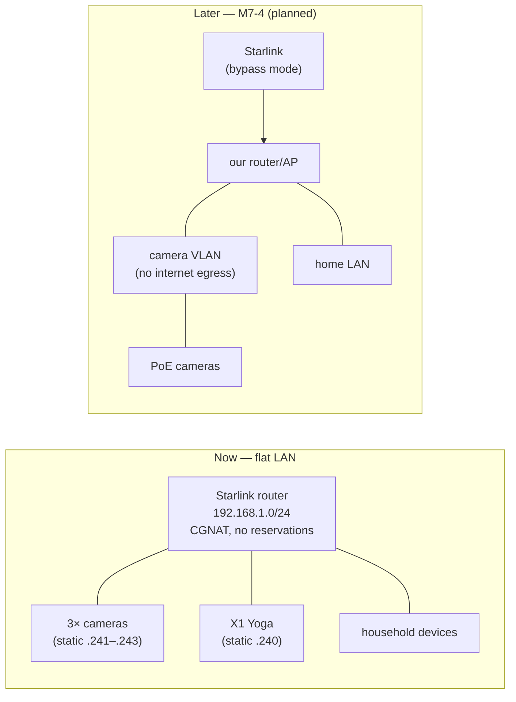

<!--
File: docs/NETWORK.md

Network assessment for the homesec project (issue M1-2).  Records the
Starlink environment, the LAN address plan the cameras and server are
configured against, the per-location WiFi survey, and the remote-viewing
bandwidth budget.  Fields that can only be measured on site are marked
"TODO (on-site)" and gathered in the checklist at the end.  The
remote-access decision itself lives in docs/adr/ADR-001-remote-access.md.
-->

# Network assessment

**Status**: living document · **Date started**: 2026-07-14 · **Issue**: M1-2

This document has two jobs: (1) record the network environment and the fixed
**address plan** that M2 (cameras) and M3 (server) configure against, and (2)
capture the **WiFi survey** and **bandwidth budget** that later decisions depend
on.  The remote-access architecture is decided separately in
[ADR-001](adr/ADR-001-remote-access.md) — short version: **Tailscale**.

As in `HARDWARE.md`, entries are either **researched facts** about Starlink /
the chosen tooling, or **on-site values** that can only be read/measured here —
the latter are marked **TODO (on-site)** and consolidated in §7.

---

## 1. Starlink environment

### 1.1 IPv4 / CGNAT

Standard residential Starlink hands each site a **private CGNAT address from
`100.64.0.0/10`** and **blocks all inbound IPv4**.  A routable public IP is an
opt-in policy available only on Priority / Mobile-Priority / Maritime plans, not
standard residential.  **Consequence: no port forwarding is possible**, which is
exactly why remote access uses an outbound overlay (ADR-001) rather than opened
ports.

*Verify on site (TODO):* in the Starlink app, or by comparing the router's WAN
address against the public address seen from a LAN client:

```sh
# On a machine on the home LAN:
curl -s https://ifconfig.me ; echo          # the public address the world sees
# In the Starlink app: Settings → the WAN IP the dish reports.
# If the reported WAN IP is in 100.64.0.0/10 (and differs from the public
# address above), the site is behind CGNAT — the expected result.
```

- CGNAT confirmed? **TODO (on-site)**

### 1.2 IPv6

Starlink provides a **native, public IPv6 `/56`** (dual-stack).  In principle
this could allow inbound IPv6, but the **stock Starlink router firewalls inbound
IPv6 and exposes no setting to open it**, so it is *not* a usable inbound path
for us.  We do not rely on it; the overlay (Tailscale) is IP-version-agnostic and
happily uses IPv6 for its underlay when available.

- IPv6 reachable from a LAN client (`curl -6 https://ifconfig.co`)? **TODO (on-site)**

### 1.3 Router model / mode

- Starlink hardware generation (Gen 2 / Gen 3 / other): **TODO (on-site)**
- Mode: **standard** (Starlink router doing DHCP/NAT) vs **bypass** (our own
  router). Day-one build assumes **standard**; moving to bypass mode + our own
  router is future work (**M7-4**), and would also fix the DHCP-reservation and
  segmentation limitations noted below.

### 1.4 DHCP behavior

The **Starlink Gen 3 router does not support DHCP reservations** (static leases),
and its app is deliberately minimal — no web admin, no visible/con­figurable DHCP
pool range.  This drives the address plan in §3: rather than reserve leases on
the router, we assign **static IPs on each device** (camera-side for the
cameras, in NixOS for the server), chosen high in the subnet to minimize the
chance of colliding with a dynamically-assigned address.

- Default LAN subnet (typically `192.168.1.0/24`, gateway `192.168.1.1`) —
  confirm actual: **TODO (on-site)**
- DHCP reservations supported on this unit? (expected: no) **TODO (on-site)**

---

## 2. Remote access

Decided in **[ADR-001](adr/ADR-001-remote-access.md)**: a **Tailscale** overlay.
Rationale in brief — it traverses Starlink's CGNAT with no inbound config (direct
WireGuard when possible, DERP relay over :443 otherwise), has one-tap phone
clients for the whole family, provides a valid Let's Encrypt TLS certificate on
the server's `*.ts.net` name (prerequisite for M5 web push), is free at
household scale, and keeps camera video end-to-end encrypted rather than routing
it through a third-party edge.

Implementation is in **M3-4** (server joins the tailnet; secrets handling) and
**M5-1** (family devices; HTTPS).  Each device ends up with two addresses: its
**LAN** address (§3, used at home) and its **tailnet** `100.x.y.z` / MagicDNS
name (used remotely).

---

## 3. LAN address plan

Fixed addresses every later step configures against.  **Assumes the default
`192.168.1.0/24` / gateway `192.168.1.1`** — adjust once §1.4 confirms the actual
subnet.  Because the Starlink router offers no reservations, each address is set
**statically on the device itself** and placed near the top of the range to
avoid the (unknown) DHCP pool.

| Device | Role | Hostname | Static LAN IP | Set where | MAC |
|--------|------|----------|---------------|-----------|-----|
| X1 Yoga | NVR server | `homesec` | `192.168.1.240` | NixOS (M3-1) | _TODO_ |
| RLC-811WA | outdoor cam | `cam-out` | `192.168.1.241` | camera Network settings (M2-1) | _TODO_ |
| Reolink E1 #a | indoor cam | `cam-in-a` | `192.168.1.242` | camera Network settings (M2-2) | _TODO_ |
| Reolink E1 #b | indoor cam | `cam-in-b` | `192.168.1.243` | camera Network settings (M2-2) | _TODO_ |

Common settings: netmask `255.255.255.0` (/24), gateway `192.168.1.1`, DNS
`192.168.1.1` (or `1.1.1.1` / `8.8.8.8`).

**Caveats / notes:**

- The chosen `.240–.243` block is a heuristic to dodge the invisible DHCP pool;
  if any device reports an address conflict, pick another high address and
  update this table.  Bypass mode + our own router (M7-4) removes this guesswork.
- MAC addresses are filled in from the unboxing step (see `HARDWARE.md` §8) so
  each static assignment is traceable to a physical unit.
- On this flat LAN, the cameras share a subnet with everything else and can
  reach the internet; we cannot block their egress without VLANs. Disabling
  Reolink UID/P2P (M2-3) stops the vendor-cloud path; full egress isolation is
  deferred to the VLAN plan in **M7-4** and flagged in the M6-4 security review.

---

## 4. WiFi signal survey

Recorded per intended camera location (survey with a phone app such as WiFiman,
Airport Utility, or an Android WiFi analyzer).  Band choice per camera balances
range (2.4 GHz reaches further / penetrates walls) against throughput and
congestion (5 GHz).  **The outdoor 811WA especially may need 2.4 GHz for range.**

> **Cross-reference (`HARDWARE.md`):** the indoor **E1 band question is open** —
> the retail box says "WiFi 6" but the classic E1 spec is **2.4 GHz-only**.
> Confirm in each E1's Reolink app (Settings → Network) whether 5 GHz is even
> offered; if not, the indoor cameras are 2.4 GHz regardless of survey results.

| Location | Camera | RSSI 2.4 GHz | RSSI 5 GHz | 5 GHz offered by cam? | Chosen band |
|----------|--------|--------------|------------|-----------------------|-------------|
| Outdoor (approach/driveway) | RLC-811WA | _TODO_ | _TODO_ | yes (dual-band) | _TODO_ |
| Indoor A | E1 #a | _TODO_ | _TODO_ | **verify** | _TODO_ |
| Indoor B | E1 #b | _TODO_ | _TODO_ | **verify** | _TODO_ |
| Server location | X1 Yoga | _TODO_ | _TODO_ | n/a (prefer wired) | _TODO_ |

Rules of thumb for placement: aim for **RSSI ≥ −67 dBm** at a camera for a
reliable stream; below roughly **−75 dBm** expect drops (which Frigate would
surface as reconnect loops in M4-2).  **Prefer wiring the server to the router**
(Ethernet via adapter) over WiFi — the NVR pulling three streams should not also
be contending for airtime.

- Survey completed and bands chosen? **TODO (on-site)**

---

## 5. Bandwidth budget (remote viewing)

Local (LAN) viewing is effectively unconstrained; the concern is **remote**
viewing, which rides the **Starlink uplink** (the constrained direction).

**Uplink:** Starlink residential upload is variable, commonly in the ~5–25 Mbps
range depending on time and congestion. **Measure the actual sustained upload**
(e.g. `speedtest`/fast.com at a few times of day) and record it:

- Measured Starlink upload: **TODO (on-site)** Mbps (min / typical)

**Per-stream cost (approximate, from the camera settings finalized in M2-4):**

| Stream | Camera | Rough bitrate |
|--------|--------|---------------|
| Sub / detect | any | ~0.5–2 Mbps |
| Main / record | E1 (4MP) | ~4 Mbps |
| Main / record | 811WA (4K, H.265) | ~6–8 Mbps |

**Budget:** Frigate's live view and event thumbnails use the low-cost sub
streams, so **1–2 concurrent remote viewers on sub streams (~1–4 Mbps total)**
fit comfortably within even a modest Starlink uplink.  Reviewing a recorded
**main-stream** clip is heavier and bursty; several simultaneous main-stream
pulls could saturate the uplink.  Two considerations to carry into M5-1:

- If the connection is **DERP-relayed** (ADR-001; likely under symmetric CGNAT),
  the same bytes traverse Starlink to reach the relay, so relayed viewing costs
  uplink bandwidth even for a single viewer — another reason to confirm a direct
  path in M3-4.
- Set family expectations: smooth live view remotely, but heavy simultaneous
  main-stream scrubbing may stutter on a busy uplink.

- Viewer budget validated against measured uplink? **TODO — M5-1**

---

## 6. Topology — now and later

**Now (day-one build):** a single flat LAN on the Starlink router's WiFi —
cameras, server, and household devices all on `192.168.1.0/24`.  Simple, and
adequate to get the system running; its limitations (no DHCP reservations, no
camera egress isolation) are worked around above.

**Later (M7-4, optional):** Starlink in **bypass mode** behind our own
router/AP, giving: a dedicated **camera VLAN with blocked internet egress**,
proper DHCP reservations, wired **PoE** backhaul for reliability, and headroom
for more cameras than the WiFi spectrum comfortably carries.  This is written up
as a plan (not built) in M7-4 and retires several residual risks from the M6-4
security review.



---

## 7. On-site checklist

To complete when back at the site:

**Starlink assessment**
- [ ] Confirm CGNAT (WAN IP in `100.64.0.0/10`; §1.1 procedure)
- [ ] Check IPv6 reachability from a LAN client (§1.2)
- [ ] Record hardware generation and confirm standard (not bypass) mode
- [ ] Confirm the LAN subnet/gateway and that DHCP reservations are unavailable

**Address plan**
- [ ] Confirm the default subnet matches §3 (adjust the table if not)
- [ ] Fill in each device's MAC (from the `HARDWARE.md` unboxing step)

**WiFi survey**
- [ ] Measure RSSI (2.4 & 5 GHz) at all four locations
- [ ] Confirm whether each E1 offers 5 GHz at all (the open band question)
- [ ] Choose a band per camera; note where wiring the server is feasible

**Bandwidth**
- [ ] Measure sustained Starlink **upload** at a few times of day
- [ ] Sanity-check the 1–2 remote-viewer budget against it

---

## Sources

Accessed 2026-07-14:

- Starlink IP / CGNAT policy — [Starlink Help Center: IP Address](https://www.starlink.com/support/article/ac09301b-cef6-a125-c251-856196a77f92);
  [CGNAT on Starlink explained (HostiFi)](https://www.hostifi.com/blog/cgnat-on-starlink-explained).
- Starlink IPv6 — [Does Starlink Support IPv6? (CellStream)](https://www.cellstream.com/2025/05/06/does-starlink-support-ipv6/).
- Starlink Gen 3 DHCP / bypass mode — [Starlink DHCP Configuration](https://www.starlink.com/support/article/afa36fff-1070-80b2-be96-eb6f78ef13be);
  [Starlink Bypass Mode (Starlink Insider)](https://starlinkinsider.com/starlink-bypass-mode/).
- Tailscale NAT traversal / DERP — [How NAT traversal works](https://tailscale.com/blog/how-nat-traversal-works);
  [DERP servers](https://tailscale.com/docs/reference/derp-servers).
- Tailscale free plan / HTTPS — [Free plans](https://tailscale.com/docs/account/manage-plans/free-plans-discounts);
  [Enabling HTTPS certificates](https://tailscale.com/docs/how-to/set-up-https-certificates).
